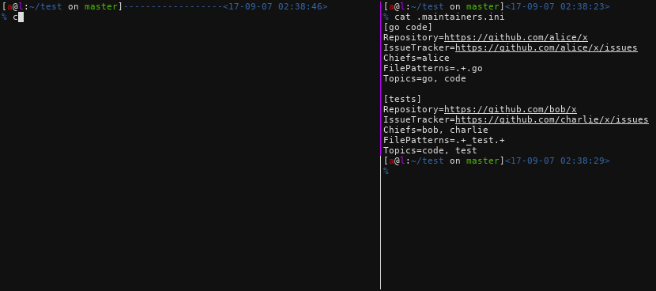
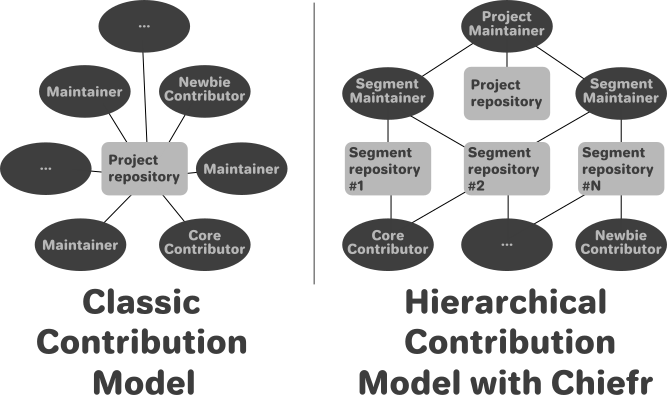

# Chiefr

Distributed project development model and toolkit

Share and decentralize the development and maintenance of different parts of a project between its members.
Chiefr is inspired by the contribution model of the Linux kernel and their `get_contributors.pl` script.




## Advantages

 - Explicitly defined responsibilities
 - Distributed contribution processing
 - Automated pull request labeling based on the contribution's content
 - Automated assignment of related maintainers to pull requests


## Why?

The current contribution scheme of a typical project is totally centralized by default.
If a contribution sent to a project/repo, every related person is notified and interrupted, so it does not scale.
Thus, a project with more than one active member generates more and more wasted time as it grows,
since all the incoming contributions and issues are propagated to every member.

Chiefr aims to solve this problem both with a better process and supporting tools.


## How?

Chiefr requires to split a single project up to multiple logical segments, where every segment has its
own maintainers, repository and optionally other services like mailing lists or chat. Depending on the size
of a project, its segments can be split into even smaller segments to be more manageable.





If you have any question about applying this model to your project, feel free to get in touch with me.


## Usage

### Chiefr tool

Chiefr is also a command-line tool which depends on `.maintainers.ini` and has the following commands:
 - `submit`: shows where to submit your patch
 - `list`: lists all the project segments
 - `update-pull-request`: updates a pull request's assignees and topics according to the `.maintainers.ini`
 - `ask`: shows where to ask questions about a topic (TODO)
 - `scan-project`: searches for project pieces that don't have maintainers (TODO)


### Maintainers file (a.k.a. `.maintainers.ini`)

Chiefr requires a `.maintainers.ini` file in the project root which defines the project's segment.
`.maintainers.ini` can contain any number of segments


#### Segment

A segment defines the resources of a logical block of the project.

Segment attributes:
 - `Chiefs`: Comma separated list of project members who are responsible for this segment
 - `Repository`: Repository URL to submit patches
 - `Chat`: Chat service URL
 - `MailList`: Mailing list URL
 - `IssueTracker`: Issue tracker URL
 - `Reviewers`: Comma separated list of project members who are responsible only for code reviews in this segment
 - `FilePatterns`: Comma separated list of regexps to specify which file to include in this segment
 - `ContentPatterns`: Comma separated list of regexps to specify what patch content should be included in this Segment
 - `FileExcludePatterns`: Comma separated list of regexps to exclude files matched by `FilePatterns` regexp
 - `ContentExcludePatterns`: Comma separated list of regexps to exclude patch content matched by `ContentPatterns` regexp
 - `Priority`: If a changeset affects multiple segments, priority can describe the order of segments listed
 - `Topics`: Comma separated list of segment's topics

example segment in `.maintainers.ini`:
```
[code]
Repository = https://github.com/asciimoo/chiefr
IssueTracker = https://github.com/asciimoo/chiefr/issues
Chiefs = asciimoo
FilePatterns = .+.go
Priority = 1
```


## Installation


Check out [releases](https://github.com/asciimoo/chiefr/releases/latest) to get the binary or

```
$ go get github.com/asciimoo/chiefr
$ "$GOPATH/bin/chiefr" --help
```


## Bugs

Bugs or suggestions? Visit the [issue tracker](https://github.com/asciimoo/chiefr/issues)
